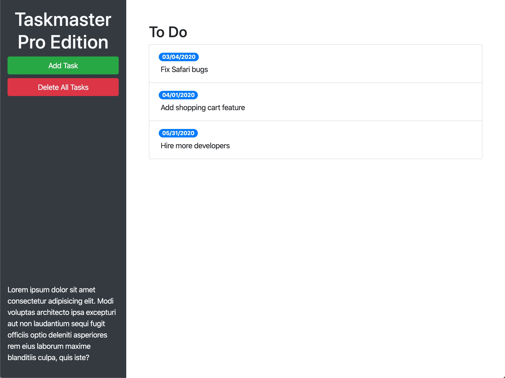

Taskmanager Pro
===
Assigned to Weng Fei Fung. An app for managing tasks. Was given a codebase with legacy code, broken code, and new business requirements that the previous developer abandoned. I took over and fixed bugs, refactored, added jQuery, and tweaked the Bootstrap layout.

Demo
---
[View task manager](//Siphon880gh.github.io/ucla-taskmanager-pro)

Screenshots
---

Features I added
---
Add task editing: 
- Click on a task's description to turn it into an editable field.
- Click on a task's due date to turn it into an editable field.
- Clicking off of either element turns it back into its original form.

Update layout for new statuses:
- Add columns for In Progress, In Review, and Done.
- Add additional Bootstrap components.

Add drag/drop capabilities:
- Implement dragging within and between columns.
- Implement dragging to trash to delete a task.

Add due date handling:
- Add a calendar datepicker for setting due dates.
- Conditionally highlight tasks that are near/overdue.

Customize/improve user experience:
- Periodically check if tasks are overdue.
- Implement custom fonts and icons.
- Customize UI colors.